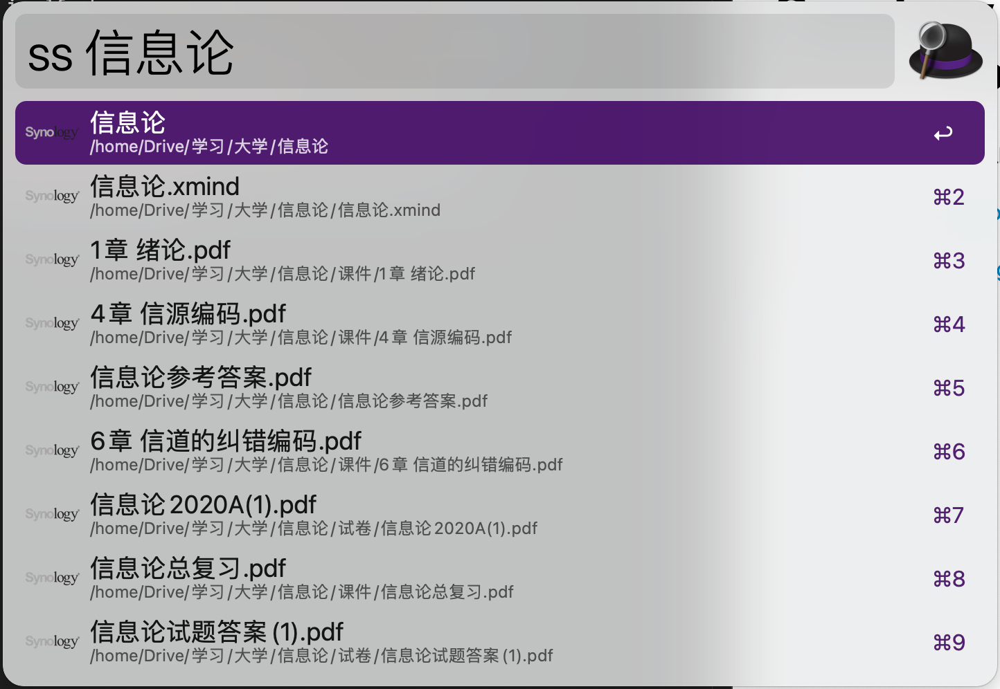
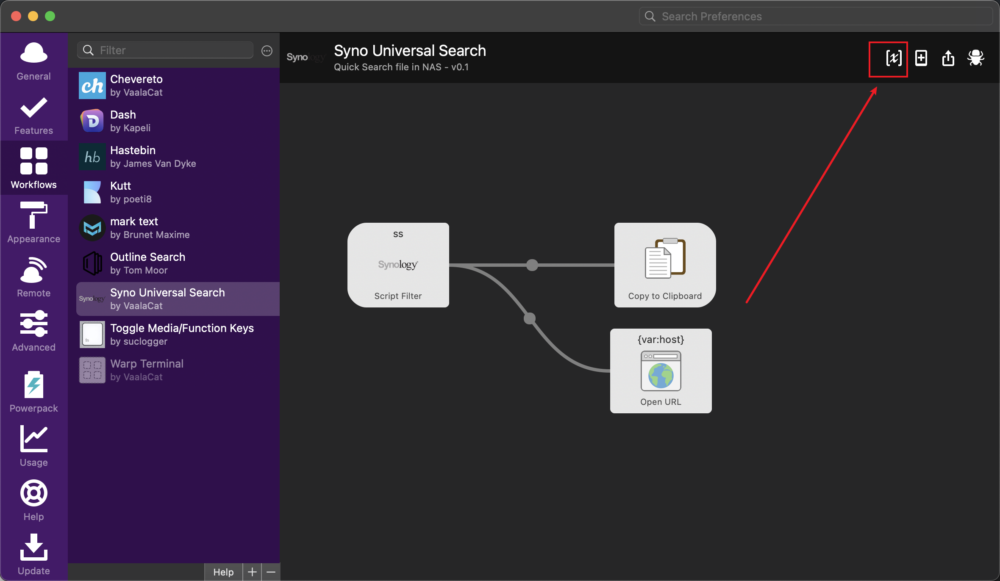

# Synology Universal Search Alfred Workflow

Use synology universal search to search for files and folders in alfred

API from [https://github.com/N4S4/synology-api](https://github.com/N4S4/synology-api)

Workflow from [https://github.com/NorthIsUp/alfred-workflow-py3](https://github.com/NorthIsUp/alfred-workflow-py3)

## Installation

1. Download the workflow from [release](https://github.com/VaalaCat/synology-alfred/releases) and drag it to Alfred Workflows menu

2. Fill the configuration in the workflow 

3. Use `ss keyword` to search